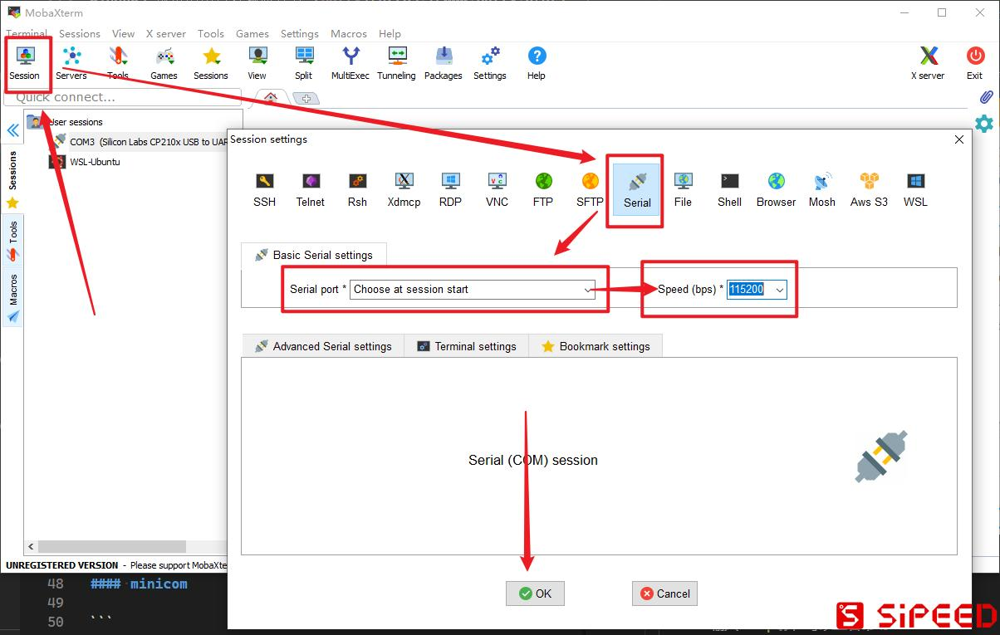
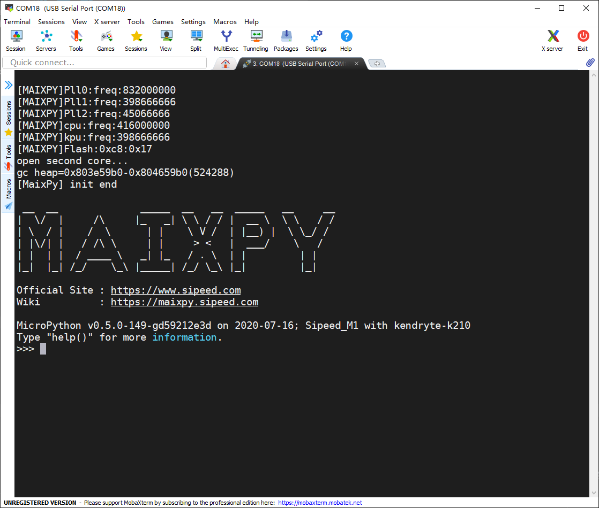
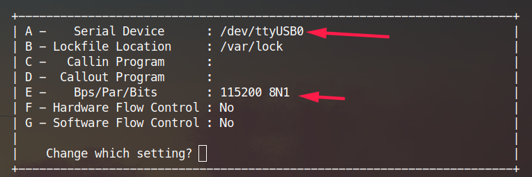

使用串口工具
========

## 连接硬件

连接 Type C 线， 一端电脑一端开发板

查看设备是否已经正确识别：

在 Linux 下可以通过 `ls /dev/ttyUSB*` 或者 `ls /dev/ttyACM*` 来查看， 如果没有可以 `ls /dev` 来找找，具体的设备名跟串口芯片和驱动有关. 也可以用`sudo dmesg`来看是否有设备挂载记录

在 Windows 下可以打开设备管理器来查看

如果没有发现设备， 需要确认有没有装驱动以及接触是否良好


## 使用串口工具

### Windows

Windows 常用的串口终端软件有 [putty](https://www.putty.org/), [mobaxterm](https://mobaxterm.mobatek.net/) [xshell](https://xshell.en.softonic.com/) 等工具

- Putty

然后选择串口模式， 然后设置串口和波特率，打开串口。


然后点击回车键，即可看到 MaixPy 的交互界面了

`>>>`

输入 `help()`，可以查看帮助

> 上图来源： [laurentopia 的上手教程](https://github.com/laurentopia/Learning-AI/wiki/MaixPy)

- Mobaxterm

[MobaXterm](https://mobaxterm.mobatek.net/) 是 Windows 下一款非常好用的多功能终端软件（当然也包括串口终端）





### Linux

使用`minicom`（推荐） 或者 `screen`等工具即可

#### minicom

```
sudo apt update
sudo apt install minicom
sudo minicom -s
# 然后根据提示设置串口号以及波特率为 115200 等，不懂可以利用搜索工具搜索
# 设置 Backspace 为 DEL 功能
# 设置 linewrap 为 Yes
sudo minicom
```

注意 minicom 的默认配置文件保存需要 sudo 权限，所以使用`sudo minicom -s`




这里按 `A` 即可设置设备

按 `E` 即可设置波特率， 波特率需要设置为 `115200`


这里按 `A` 和 `R` 将设置切换为图中的设置一样， 第一个是为了后面使用 `pye` 编辑器快捷键不冲突， 第二个自动换行的设置是为了能显示完全输出

设置完后保存退出，下次就不需要再设置了，只需要执行 `sudo minicom` 即可, 如果不想每次都使用`sudo`命令， 执行`sudo usermod -a -G dialout $(whoami)` 将自己添加到`dialout`用户组即可，可能需要注销或者重启才能生效，注意`sudo minicom -s` 如果需要修改默认配置文件还是需要 `sudo`

进入`minicom`后点击回车键或者开发板的复位按钮，即可看到 MaixPy 的交互界面了


输入 `help()`，可以查看帮助

要退出`minicom`， 按 `Ctrl+A` `X`，按 `Enter` 确认退出即可

> 另外，在开发过程中可能串口号会变， 可以在执行 minicom 的时候指定串口号，这样就不用每次串口号变了都设置一遍了，比如：` minicom -D /dev/ttyUSB1 -b 115200`
